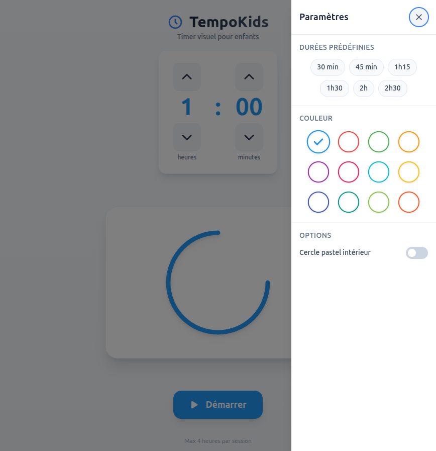

# TempoKids - Time Timer

Application PWA de gestion visuelle du temps pour enfants. Représentation analogique avec des ronds d'horloge (1 rond = 1 heure) qui aident les enfants à comprendre le temps restant.



## Fonctionnalités

- **Saisie intuitive** : Configurez la durée en heures et minutes (max 4 heures)
- **Ronds d'horloge** : Chaque rond représente 1 heure (style Time-Timer)
- **Design dual-arc** : Arc coloré externe + arc pastel interne optionnel qui se vident ensemble
- **Menu burger** : Accès rapide à des durées prédéfinies (30 min, 45 min, 1h15, 1h30, 2h, 2h30)
- **Sélecteur de couleur** : 12 couleurs personnalisables (persistées en localStorage)
- **Toggle cercle pastel** : Activation/désactivation du cercle pastel intérieur (désactivé par défaut)
- **Contour de cadran** : Cercle noir fin toujours visible, indépendant du mécanisme du timer
- **Graduations minutes** : Affichage optionnel des 60 traits de graduation (toggle dans le menu)
- **Graduations 5 minutes** : Affichage optionnel des 12 traits prononcés (toggle dans le menu)
- **Décompte visuel** : Le remplissage se retire dans le sens horaire depuis 12h
- **Contrôles simples** : Démarrer, Pause, Reset
- **Animation pause** : Pulsation visuelle quand le timer est en pause
- **Design mobile-first** : Interface optimisée pour mobiles et tablettes
- **Persistance de l'état** : L'état du timer est conservé lors du rechargement (timer en cours, pause, configuration)
- **Mode hors ligne** : Fonctionne sans connexion internet
- **Indicateur réseau** : Bannière d'état hors ligne/en ligne
- **Installable** : Application PWA installable sur mobile
- **Accessibilité** : Focus visible, zoom autorisé (WCAG compliant)
- **Robustesse** : Error Boundary pour capturer les erreurs React

## Stack Technique

- **React 18+** - Framework UI
- **TypeScript** - Typage statique
- **Vite** - Build tool
- **Tailwind CSS** - Styling
- **vite-plugin-pwa** - Support PWA
- **Vitest** - Tests unitaires

## Installation

```bash
# Cloner le projet
git clone <repository-url>
cd time-timer

# Installer les dépendances
pnpm install

# Lancer en développement
pnpm dev

# Lancer les tests
pnpm test

# Build production
pnpm build

# Preview production
pnpm preview
```

## Structure du Projet

```
src/
├── components/           # Composants React
│   ├── ClockCircle/     # Rond d'horloge SVG
│   ├── Controls/        # Boutons de contrôle
│   ├── DurationPicker/  # Saisie de durée
│   ├── TimerDisplay/    # Affichage des ronds
│   ├── ErrorBoundary/   # Capture d'erreurs React
│   ├── OfflineIndicator/ # Indicateur réseau
│   ├── BurgerMenu/      # Menu burger avec durées prédéfinies
│   └── icons/           # Composants icônes (Play, Pause, Reset, Burger...)
├── hooks/               # Hooks personnalisés
│   ├── useTimer.ts      # Logique du timer
│   ├── useLocalStorage.ts
│   └── useNetworkStatus.ts # Détection online/offline
├── utils/               # Fonctions utilitaires
│   ├── time.ts          # Calculs de temps
│   └── svg.ts           # Calculs SVG
├── types/               # Types TypeScript
├── constants/           # Constantes de design
├── App.tsx              # Composant racine
└── main.tsx             # Point d'entrée

tests/                   # Tests Vitest
public/                  # Assets statiques, manifest PWA
```

## Scripts Disponibles

| Commande | Description |
|----------|-------------|
| `pnpm dev` | Développement avec hot reload |
| `pnpm build` | Build production |
| `pnpm preview` | Preview du build |
| `pnpm test` | Tests unitaires |
| `pnpm test:watch` | Tests en mode watch |
| `pnpm lint` | Vérification ESLint |
| `pnpm type-check` | Vérification TypeScript |

## Design

### Couleurs

| Couleur | Hex | Usage |
|---------|-----|-------|
| Bleu TempoKids | `#2196F3` | Remplissage actif |
| Gris | `#E0E0E0` | Ronds vides |
| Noir cadran | `#333333` | Contour cadran et graduations |
| Fond | `#FFFFFF` | Arrière-plan |

### Comportement

1. **Configuration** : L'utilisateur sélectionne une durée (1 min - 4h, max 4 cercles)
2. **Affichage** : Les ronds s'affichent dans l'ordre : ronds pleins (heures complètes) d'abord, rond partiellement rempli en dernier
3. **Démarrage** : Le remplissage bleu commence à se retirer depuis 12h dans le sens horaire
4. **Progression** : Le premier rond se vide en premier, le rond partiel se vide en dernier
5. **Fin** : Tous les ronds sont vides, le timer est terminé
6. **Persistance** : L'état est conservé au rechargement (timer running reprend avec temps écoulé calculé, pause restaurée exacte, configuration préservée)

## Tests

```bash
# Lancer tous les tests
pnpm test

# Tests en mode watch
pnpm test:watch

# Couverture de code
pnpm test:coverage
```

**Résultats actuels** : 162 tests passés

## PWA

L'application est une Progressive Web App complète :
- **Installable** sur l'écran d'accueil mobile
- **Fonctionne hors ligne** grâce au service worker
- **Mise en cache** automatique des assets

Pour installer sur mobile :
1. Ouvrir l'application dans le navigateur
2. Utiliser "Ajouter à l'écran d'accueil"
3. L'app se lance en mode standalone

## Documentation

- [Architecture](./docs/ARCHITECTURE.md) — mental model, data flow, SVG rendering
- [Glossaire](./docs/GLOSSARY.md) — vocabulaire du domaine
- [Problèmes connus](./docs/KNOWN_ISSUES.md) — dette technique, zones fragiles
- [ADRs](./docs/adr/) — décisions d'architecture (SVG, rAF, persistance, etc.)
- [Spécifications features](./specs/) — specs, plans et tasks par feature (001-006)

## Infrastructure

Ce projet utilise Terraform pour gérer le dépôt GitHub.

### Prérequis Infrastructure

- [Terraform](https://www.terraform.io/) >= 1.0
- Un token GitHub avec les permissions nécessaires
- [direnv](https://direnv.net/) pour la gestion des variables d'environnement
- [pass](https://www.passwordstore.org/) pour le stockage sécurisé du token

### Déploiement Infrastructure

```bash
cd terraform
terraform init
terraform plan
terraform apply
```

## Pre-commit

Ce projet utilise [pre-commit](https://pre-commit.com/) pour maintenir la qualité du code.

```bash
# Installer pre-commit
pip install pre-commit

# Installer les hooks
pre-commit install

# Exécuter sur tous les fichiers
pre-commit run --all-files
```

## Licence

MIT
