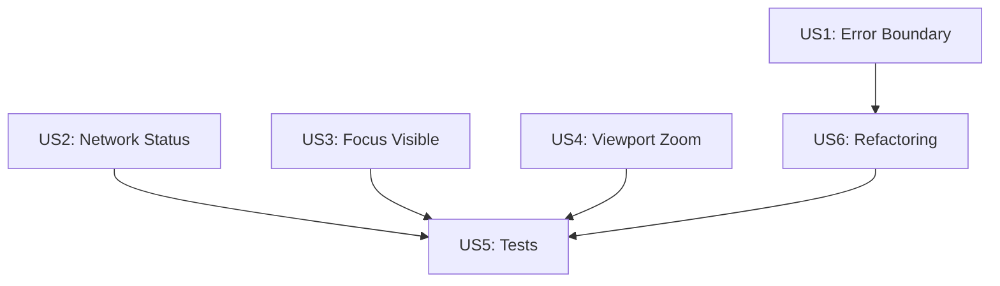

# Implementation Plan: Code Quality Fixes

**Branch**: `003-code-quality-fixes` | **Date**: 2025-12-20 | **Spec**: [spec.md](./spec.md)
**Input**: Feature specification from `/specs/003-code-quality-fixes/spec.md`

## Summary

Cette feature regroupe les améliorations de qualité identifiées lors de la revue de code senior :
- **Stabilité** : Error Boundary pour capturer les erreurs React
- **UX** : Indicateur d'état réseau offline/online
- **Accessibilité** : Focus visible sur boutons, zoom viewport autorisé
- **PWA** : navigateFallback dans workbox
- **Maintenabilité** : Suppression duplication code, extraction icônes
- **Tests** : Couverture composants React

## Technical Context

**Language/Version**: TypeScript 5.x, React 18+
**Primary Dependencies**: React, Vite, Tailwind CSS, vite-plugin-pwa, @testing-library/react
**Storage**: localStorage (déjà implémenté)
**Testing**: Vitest + @testing-library/react (déjà configuré)
**Target Platform**: Web PWA (mobile-first, desktop compatible)
**Project Type**: Single web application (React SPA)
**Performance Goals**: Lighthouse Performance >= 95, Accessibility >= 95, PWA = 100
**Constraints**: Offline-capable, bundle léger, animations fluides 60fps
**Scale/Scope**: Application simple, ~15 composants, ~50 tests

## Constitution Check

*GATE: Must pass before Phase 0 research. Re-check after Phase 1 design.*

| Principe | Statut | Notes |
|----------|--------|-------|
| **Simplicité Absolue** | ✅ PASS | Améliorations légères sans complexité ajoutée |
| **Clarté Visuelle Maximale** | ✅ PASS | Indicateur offline discret, focus visible |
| **Accessibilité Enfant** | ✅ PASS | Améliore l'accessibilité (zoom, clavier) |
| **Mobile-First & Offline** | ✅ PASS | navigateFallback renforce offline |
| **Performance** | ✅ PASS | Pas d'impact performance, tests légers |
| **Pas de dépendances inutiles** | ✅ PASS | Utilise dépendances existantes |

**Gate Result**: ✅ PASSED - Toutes les améliorations respectent la constitution

## Project Structure

### Documentation (this feature)

```text
specs/003-code-quality-fixes/
├── spec.md              # Spécification feature
├── plan.md              # This file
├── research.md          # Phase 0 output
├── checklists/          # Quality checklists
│   └── requirements.md  # Spec validation checklist
└── tasks.md             # Phase 2 output (/speckit.tasks)
```

### Source Code (repository root)

```text
src/
├── components/
│   ├── ClockCircle/          # Existing - add tests
│   ├── Controls/             # Existing - add focus visible + tests
│   ├── DurationPicker/       # Existing - add tests
│   ├── TimerDisplay/         # Existing - add tests
│   ├── ErrorBoundary/        # NEW - Error boundary component
│   │   ├── ErrorBoundary.tsx
│   │   └── index.ts
│   ├── OfflineIndicator/     # NEW - Network status indicator
│   │   ├── OfflineIndicator.tsx
│   │   └── index.ts
│   └── icons/                # NEW - Extracted icon components
│       ├── TimerIcon.tsx
│       ├── CheckIcon.tsx
│       ├── PlayIcon.tsx
│       ├── PauseIcon.tsx
│       ├── ResetIcon.tsx
│       └── index.ts
├── hooks/
│   ├── useTimer.ts           # Existing
│   ├── useLocalStorage.ts    # Existing
│   └── useNetworkStatus.ts   # NEW - Network status hook
├── utils/
│   ├── time.ts               # Existing - already has formatTime
│   └── svg.ts                # Existing
├── App.tsx                   # Modify - use ErrorBoundary, OfflineIndicator, icons
└── main.tsx                  # Existing

tests/
├── components/               # NEW - Component tests
│   ├── ClockCircle.test.tsx
│   ├── Controls.test.tsx
│   ├── DurationPicker.test.tsx
│   ├── TimerDisplay.test.tsx
│   ├── ErrorBoundary.test.tsx
│   └── OfflineIndicator.test.tsx
├── hooks/
│   ├── useTimer.test.ts      # Existing
│   └── useNetworkStatus.test.ts  # NEW
└── utils/                    # Existing
    ├── time.test.ts
    └── svg.test.ts

# Config files to modify
index.html                    # Remove user-scalable=no
vite.config.ts               # Add navigateFallback to workbox
```

**Structure Decision**: Extension de la structure existante avec nouveaux composants dans src/components/ et nouveaux tests dans tests/components/. Pas de changement architectural majeur.

## Complexity Tracking

> Aucune violation de constitution - section non applicable

## Implementation Approach

### Phase 1: Stabilité (P1)
- ErrorBoundary component avec fallback UI
- Wrap App content avec ErrorBoundary

### Phase 2: UX & Accessibilité (P2)
- useNetworkStatus hook
- OfflineIndicator component
- Focus visible sur tous les boutons (Controls, DurationPicker)

### Phase 3: Accessibilité Viewport (P3)
- Modifier index.html pour autoriser zoom

### Phase 4: PWA (P3)
- Ajouter navigateFallback dans vite.config.ts

### Phase 5: Maintenabilité (P4)
- Supprimer formatTimeDisplay, utiliser formatTime
- Extraire icônes dans src/components/icons/

### Phase 6: Tests (P3)
- Tests composants avec @testing-library/react
- Vérification accessibilité (aria-labels, focus)

## Dependencies



- US1 (Error Boundary) peut être fait en parallèle de US2-US4
- US5 (Tests) dépend de tous les autres pour tester les nouvelles fonctionnalités
- US6 (Refactoring) peut être fait en parallèle mais avant les tests finaux
